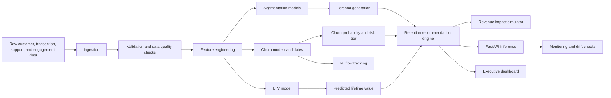

# Customer Intelligence Platform

Telecom companies lose millions of dollars when customers churn, but most churn projects stop at a probability score.
Business teams still need to know which customers are worth saving, why they are at risk, what action to take, and what
financial return the intervention could create.

This project turns the IBM Telco Customer Churn dataset into an end-to-end **Customer Intelligence Platform**: churn
prediction, customer segmentation, lifetime value modeling, retention recommendations, revenue simulation, explainability,
API serving, experiment tracking, and an executive dashboard.

**Key results on 7,043 IBM Telco customers**

| Outcome | Result |
| --- | ---: |
| Churn model ROC-AUC | `0.847` |
| LTV model R2 | `0.996` |
| Simulated retention ROI | `6.0x` |
| Estimated net business impact | `$101K` |
| Observed churn rate | `26.5%` |

**Why it matters:** A churn model predicts risk. A customer intelligence platform helps a company decide where to act,
how to act, and whether the action is financially worth it.


## 2. Live Demo

**Live Streamlit app:** [Customer Intelligence Platform Dashboard](https://customer-intelligence-platform-mw3nn2xznmxnhbtk98mkyw.streamlit.app/Churn_and_LTV)

## 3. Problem Definition

### Business Context

Subscription businesses such as telecom, streaming, SaaS, and fintech rely on recurring revenue. When customers churn,
the company loses current revenue, future lifetime value, acquisition payback, and potential referral value. Retention
teams often have limited budget, so they cannot offer incentives or outreach to every customer.

### Current Solution

Many churn workflows are built as standalone notebooks that output a model score. That creates three business gaps:

- Marketing does not know which risky customers are economically worth targeting.
- Customer success does not know which action fits each customer.
- Executives cannot quantify campaign ROI before spending money.

### Proposed Solution

Build a production-style customer decisioning platform that combines:

- **Segmentation:** who the customers are.
- **Churn prediction:** who is likely to leave.
- **Lifetime value:** who is financially important.
- **Explainability:** why the model believes a customer is at risk.
- **Retention recommendations:** what action to take.
- **Revenue simulation:** what impact the action could create.

## What This Demonstrates

- IBM Telco Customer Churn ingestion and validation with automated quality checks.
- RFM, engagement, support, value, lifecycle, and risk feature engineering.
- Customer segmentation with KMeans, DBSCAN, and hierarchical clustering.
- Persona generation that translates clusters into business playbooks.
- Churn prediction with Logistic Regression, Random Forest, XGBoost, LightGBM, and CatBoost.
- Explainability hooks for SHAP and LIME.
- Customer lifetime value prediction.
- Retention recommendation engine and revenue impact simulator.
- FastAPI service, Streamlit executive dashboard, MLflow tracking, Docker, tests, CI, SQL schema, and monitoring utilities.

### Data Pipeline

The project uses the public **IBM Telco Customer Churn dataset** with 7,043 customers and 21 original fields, including
tenure, contract type, monthly charges, total charges, internet service, tech support, billing method, payment method,
and churn label.

Pipeline steps:

1. Load the IBM Telco CSV from `data/raw/ibm_telco_customer_churn.csv`.
2. Validate required fields, uniqueness, ranges, null rates, and binary churn labels.
3. Convert the Telco schema into a canonical customer intelligence schema.
4. Generate model-ready features for churn, LTV, segmentation, recommendations, and dashboarding.
5. Write processed outputs only at runtime so the repository stays lightweight.

### Feature Engineering

The feature layer combines Telco-native features with business-oriented customer intelligence signals:

- **Lifecycle:** tenure, contract type, customer age proxy, recency proxy.
- **Revenue:** monthly charges, total charges, annualized revenue, revenue per purchase.
- **RFM:** recency, frequency, monetary value, RFM score.
- **Service adoption:** phone service, internet service, streaming, backup, device protection.
- **Risk drivers:** month-to-month contract, electronic check, fiber optic service, lack of tech support, lack of online security.
- **Engagement proxies:** service count, session intensity, support load.
- **Customer profile:** senior citizen, partner, dependents, gender.

### Models

The platform trains and compares multiple model families:

| Task | Methods |
| --- | --- |
| Churn prediction | Logistic Regression, Random Forest, XGBoost, LightGBM, CatBoost |
| Segmentation | KMeans, DBSCAN, Hierarchical Clustering |
| Lifetime value | Gradient boosting regression |
| Explainability | SHAP and LIME hooks |
| Recommendations | Rule-based retention strategy engine |
| Revenue impact | Scenario simulator using churn risk, LTV, margin, intervention cost, and success rate |

Logistic Regression is kept as an interpretable baseline and performed best on this dataset, which makes sense because
the strongest churn drivers are structured business variables such as contract type, tenure, billing method, and support
coverage.


## Architecture



## Folder Structure

```text
customer-intelligence-platform/
├── api/                         # FastAPI service
├── churn/                       # Churn-specific CLI entrypoint
├── dashboard/                   # Streamlit dashboard pages
├── data/                        # Raw and processed data
├── docs/                        # Architecture and business documentation
├── ltv/                         # LTV-specific CLI entrypoint
├── mlflow/                      # Model artifacts and MLflow outputs
├── notebooks/                   # Exploration only; production code is in src
├── recommendation/              # Retention recommendation entrypoint
├── segmentation/                # Segmentation entrypoint
├── sql/                         # Warehouse schema design
├── src/customer_intelligence/   # Core package
└── tests/                       # Unit tests
```

## Quickstart

```bash
python -m venv .venv
source .venv/bin/activate
pip install -r requirements.txt
export PYTHONPATH=$PWD/src:$PWD
python -m customer_intelligence.pipeline
pytest -q
uvicorn api.main:app --reload
streamlit run dashboard/Home.py
```

API docs are available at `http://127.0.0.1:8000/docs` after starting FastAPI.

The pipeline uses `data/raw/ibm_telco_customer_churn.csv` when present. If you need to fetch it again:

```bash
curl -L https://raw.githubusercontent.com/IBM/telco-customer-churn-on-icp4d/master/data/Telco-Customer-Churn.csv \
  -o data/raw/ibm_telco_customer_churn.csv
```

## Docker

```bash
docker build -t customer-intelligence-platform .
docker run -p 8000:8000 customer-intelligence-platform
```

## MLflow

```bash
export PYTHONPATH=$PWD/src:$PWD
python -m customer_intelligence.mlflow_tracking
mlflow ui
```

## Business Decisions and Model Choices

RFM analysis is included because executives understand recency, frequency, and monetary value. The IBM Telco dataset is
subscription-level rather than transaction-event-level, so the pipeline creates transparent RFM proxies from tenure,
monthly charges, contract type, and recent billing behavior.

KMeans is used for stable, explainable segment centroids. DBSCAN is included to identify outliers and niche behavior
patterns that centroid methods can hide. Hierarchical clustering is useful for stakeholder workshops because dendrogram
thinking helps explain how segments relate to each other.

Logistic Regression is the interpretable baseline. Random Forest captures nonlinear behavior with low preprocessing
risk. XGBoost, LightGBM, and CatBoost represent modern gradient-boosted trees commonly used in tabular production
systems. The selected model is chosen by ROC-AUC, while average precision is tracked because churn intervention usually
targets a small high-risk slice.

SHAP and LIME are included because business owners need model reasons, not only model scores. SHAP supports global and
local additive attribution; LIME provides local perturbation explanations useful for customer success review workflows.

LTV is modeled as expected retained revenue so the platform can rank interventions by risk-adjusted economic value.
This avoids the common mistake of targeting every high-risk user equally, even when their revenue impact differs.

The retention engine maps Telco drivers to actions. Customers without support/security add-ons receive service recovery
or plan education, high-value customers get concierge outreach, electronic-check month-to-month customers get billing
and contract interventions, and inactive customers get activation journeys.

## Latest IBM Telco Training Run

The current pipeline was trained on 7,043 IBM Telco customers. The best churn model selected by ROC-AUC was Logistic
Regression, which is strong for this dataset because the key drivers are highly interpretable contract, billing, tenure,
and service-adoption effects.

| Metric | Value |
| --- | ---: |
| Churn ROC-AUC | 0.847 |
| Churn average precision | 0.665 |
| Churn F1 | 0.618 |
| LTV MAE | 14.38 |
| LTV R2 | 0.996 |
| Observed churn rate | 26.5% |
| Simulated retention ROI | 6.0x |

## Expected Business Impact

The simulator estimates impact as:

```text
saved_revenue = churn_probability * annual_revenue * intervention_success_rate
gross_profit = saved_revenue * gross_margin
net_impact = gross_profit - campaign_cost
ROI = net_impact / campaign_cost
```

With the default assumptions of 62% gross margin, 18% intervention success, and a $12 outreach cost, the IBM Telco run
estimates about `$101K` net impact and `6.0x` ROI when targeting the top 20% of risk-weighted customer value.

## 8. Future Improvements

- Add real-time event ingestion from Kafka or cloud pub/sub.
- Store features in a feature store such as Feast.
- Add model registry promotion workflows in MLflow.
- Add calibration curves and threshold optimization by campaign budget.
- Add fairness and bias checks across senior citizen, gender, and household groups.
- Replace rule-based recommendations with uplift modeling or causal treatment effect estimation.
- Add A/B testing support for retention campaign measurement.
- Add authentication and role-based access for dashboard/API users.
- Deploy FastAPI separately on a cloud service and connect Streamlit as the business UI.
- Add scheduled retraining and monitoring jobs through GitHub Actions or Airflow.
- Add a short video demo or GIF walkthrough for recruiters who do not click through the live app.
