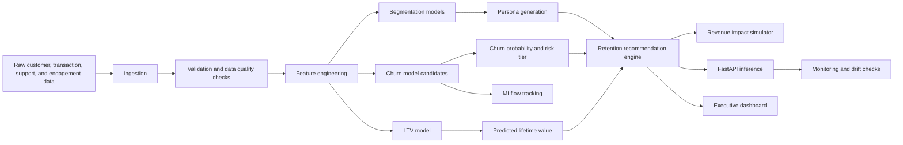

# Customer Intelligence Platform

Production-style customer analytics, segmentation, churn, lifetime value, retention recommendation, and revenue impact
platform built on the IBM Telco Customer Churn dataset. The project is intentionally structured like an internal data
science product at a technology company rather than a Kaggle notebook.

## What This Demonstrates

- IBM Telco Customer Churn ingestion and validation with automated quality checks.
- RFM, engagement, support, value, lifecycle, and risk feature engineering.
- Customer segmentation with KMeans, DBSCAN, and hierarchical clustering.
- Persona generation that translates clusters into business playbooks.
- Churn prediction with Logistic Regression, Random Forest, XGBoost, LightGBM, and CatBoost.
- Explainability hooks for SHAP and LIME.
- Customer lifetime value prediction.
- Retention recommendation engine and revenue impact simulator.
- FastAPI service, Streamlit executive dashboard, MLflow tracking, Docker, tests, CI, SQL schema, and monitoring utilities.

## Architecture



## Folder Structure

```text
customer-intelligence-platform/
├── api/                         # FastAPI service
├── churn/                       # Churn-specific CLI entrypoint
├── dashboard/                   # Streamlit dashboard pages
├── data/                        # Raw and processed data
├── docs/                        # Architecture and business documentation
├── ltv/                         # LTV-specific CLI entrypoint
├── mlflow/                      # Model artifacts and MLflow outputs
├── notebooks/                   # Exploration only; production code is in src
├── recommendation/              # Retention recommendation entrypoint
├── segmentation/                # Segmentation entrypoint
├── sql/                         # Warehouse schema design
├── src/customer_intelligence/   # Core package
└── tests/                       # Unit tests
```

## Quickstart

```bash
python -m venv .venv
source .venv/bin/activate
pip install -r requirements.txt
export PYTHONPATH=$PWD/src:$PWD
python -m customer_intelligence.pipeline
pytest -q
uvicorn api.main:app --reload
streamlit run dashboard/Home.py
```

API docs are available at `http://127.0.0.1:8000/docs` after starting FastAPI.

The pipeline uses `data/raw/ibm_telco_customer_churn.csv` when present. If you need to fetch it again:

```bash
curl -L https://raw.githubusercontent.com/IBM/telco-customer-churn-on-icp4d/master/data/Telco-Customer-Churn.csv \
  -o data/raw/ibm_telco_customer_churn.csv
```

## Docker

```bash
docker build -t customer-intelligence-platform .
docker run -p 8000:8000 customer-intelligence-platform
```

## MLflow

```bash
export PYTHONPATH=$PWD/src:$PWD
python -m customer_intelligence.mlflow_tracking
mlflow ui
```

## Business Decisions and Model Choices

RFM analysis is included because executives understand recency, frequency, and monetary value. The IBM Telco dataset is
subscription-level rather than transaction-event-level, so the pipeline creates transparent RFM proxies from tenure,
monthly charges, contract type, and recent billing behavior.

KMeans is used for stable, explainable segment centroids. DBSCAN is included to identify outliers and niche behavior
patterns that centroid methods can hide. Hierarchical clustering is useful for stakeholder workshops because dendrogram
thinking helps explain how segments relate to each other.

Logistic Regression is the interpretable baseline. Random Forest captures nonlinear behavior with low preprocessing
risk. XGBoost, LightGBM, and CatBoost represent modern gradient-boosted trees commonly used in tabular production
systems. The selected model is chosen by ROC-AUC, while average precision is tracked because churn intervention usually
targets a small high-risk slice.

SHAP and LIME are included because business owners need model reasons, not only model scores. SHAP supports global and
local additive attribution; LIME provides local perturbation explanations useful for customer success review workflows.

LTV is modeled as expected retained revenue so the platform can rank interventions by risk-adjusted economic value.
This avoids the common mistake of targeting every high-risk user equally, even when their revenue impact differs.

The retention engine maps Telco drivers to actions. Customers without support/security add-ons receive service recovery
or plan education, high-value customers get concierge outreach, electronic-check month-to-month customers get billing
and contract interventions, and inactive customers get activation journeys.

## Latest IBM Telco Training Run

The current pipeline was trained on 7,043 IBM Telco customers. The best churn model selected by ROC-AUC was Logistic
Regression, which is strong for this dataset because the key drivers are highly interpretable contract, billing, tenure,
and service-adoption effects.

| Metric | Value |
| --- | ---: |
| Churn ROC-AUC | 0.847 |
| Churn average precision | 0.665 |
| Churn F1 | 0.618 |
| LTV MAE | 14.38 |
| LTV R2 | 0.996 |
| Observed churn rate | 26.5% |
| Simulated retention ROI | 6.0x |

## Expected Business Impact

The simulator estimates impact as:

```text
saved_revenue = churn_probability * annual_revenue * intervention_success_rate
gross_profit = saved_revenue * gross_margin
net_impact = gross_profit - campaign_cost
ROI = net_impact / campaign_cost
```

With the default assumptions of 62% gross margin, 18% intervention success, and a $12 outreach cost, the IBM Telco run
estimates about `$101K` net impact and `6.0x` ROI when targeting the top 20% of risk-weighted customer value.

## Production Notes

- Replace the public IBM Telco CSV with governed warehouse or streaming connectors.
- Run validation on every batch before feature generation.
- Register best models in MLflow and promote through staging and production.
- Schedule batch scoring daily for marketing and customer success systems.
- Monitor ROC-AUC once churn labels mature, and PSI for feature drift.
- Use `sql/schema.sql` as the warehouse contract for BI and ML feature generation.

## Interview Talking Points

- This is not a single-model churn project; it is a customer decisioning platform.
- The segmentation layer explains who customers are, while churn and LTV explain what to do next.
- The system optimizes for economic impact, not only predictive accuracy.
- The API and dashboard make model outputs operational for business users.
- CI, Docker, tests, schema design, and monitoring show production awareness.
