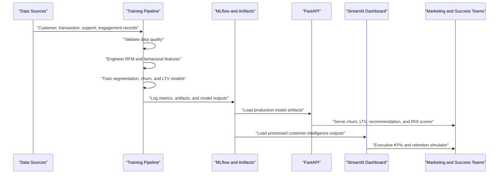
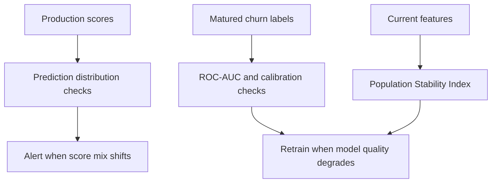

# Architecture Notes

## Platform Flow

## Monitoring

## Data Quality Contract

- Customer IDs must be unique.
- Required columns must be present before feature generation.
- Numeric fields are range checked.
- Churn labels must be binary.
- High null-rate fields are flagged as warnings so the pipeline can distinguish data failures from source-quality debt.
